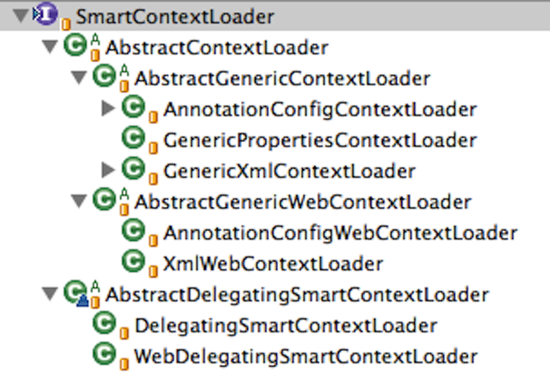

!SLIDE subsection
# Web Testing Support in the TestContext Framework

!SLIDE bullets incremental small
# New Web Testing Features
* First-class `WebApplicationContext` support
* `Request` and `Session` scoped beans

!SLIDE subsection
# Loading a `WebApplicationContext`

!SLIDE bullets center
* How do you tell the TestContext framework to load a `WebApplicationContext`?

!SLIDE bullets center
* Just annotate your test class with ...

!SLIDE incremental small
# `@WebAppConfiguration`
* Denotes that the `ApplicationContext` should be a `WebApplicationContext`
* Configures the resource path for the web app
  * used in the `MockServletContext`
* Defaults to `"src/main/webapp"`
* Paths are file-system folders, relative to the project root
  * not classpath resources
* The `classpath:` prefix is also supported

!SLIDE smaller
# Example: @WebAppConfiguration
	@@@ java
	
	// defaults to "file:src/main/webapp"
	@WebAppConfiguration

	// detects "WacTests-context.xml" in same package
	// or static nested @Configuration class
	@ContextConfiguration
	
	public class WacTests {
		//...
	}

!SLIDE smaller
# Example: @WebAppConfiguration
	@@@ java
	
	// file system resource
	@WebAppConfiguration("webapp")
	
	// classpath resource
	@ContextConfiguration("/spring/test-servlet-config.xml")
	
	public class WacTests {
		//...
	}

!SLIDE smaller
# Example: @WebAppConfiguration
	@@@ java
	
	// classpath resource
	@WebAppConfiguration("classpath:test-web-resources")
	
	// file system resource
	@ContextConfiguration(
	    "file:src/main/webapp/WEB-INF/servlet-config.xml")
	
	public class WacTests {
		//...
	}

!SLIDE incremental small
# Web Context Loaders
* New `AbstractGenericWebContextLoader`
* And two concrete subclasses:
  * `XmlWebContextLoader`
  * `AnnotationConfigWebContextLoader`
* Plus a `WebDelegatingSmartContextLoader`

!SLIDE center small transition=fade
# `SmartContextLoader` 3.2

!SLIDE incremental smaller
# `ServletTestExecutionListener`
* Sets up default thread-local state via `RequestContextHolder` before each test method
* Creates:
  * `MockHttpServletRequest`
  * `MockHttpServletResponse`
  * `ServletWebRequest`
* Ensures that the `MockHttpServletResponse` and `ServletWebRequest` can be injected into the test instance
* Cleans up thread-local state after each test method

!SLIDE center small
# `TestExecutionListener` 2.5

!SLIDE center small transition=fade
# `TestExecutionListener` 3.2

!SLIDE smaller
# Example: Injecting Mocks
	@@@ java
	@WebAppConfiguration
	@ContextConfiguration
	public class WacTests {
		
		@Autowired WebApplicationContext wac; // cached
		
		@Autowired MockServletContext servletContext; // cached
		
		@Autowired MockHttpSession session;
		
		@Autowired MockHttpServletRequest request;
		
		@Autowired MockHttpServletResponse response;
		
		@Autowired ServletWebRequest webRequest;
		
		//...
	}

!SLIDE subsection
# Web Application Context Caching

!SLIDE incremental small
# `WebMergedContextConfiguration`
* Extension of `MergedContextConfiguration`
* Supports the base resource path from `@WebAppConfiguration`
  * which is now part of the _context cache key_

!SLIDE subsection
# Request and Session Scoped Beans

!SLIDE incremental small
# Web Scopes
* __request__: lifecycle tied to the current `HttpServletRequest`
* __session__: lifecycle tied to the current `HttpSession`

!SLIDE smaller
# Example: Request-scoped Bean Config
	@@@ xml
	<beans ...>
	
	  <bean id="userService"
	      class="com.example.SimpleUserService"
	      c:loginAction-ref="loginAction" />
	
	  <bean id="loginAction" class="com.example.LoginAction"
	      c:username="#{request.getParameter('user')}"
	      c:password="#{request.getParameter('pswd')}"
	      scope="request">
	    <aop:scoped-proxy />
	  </bean>
		
	</beans>

!SLIDE smaller
# Example: Request-scoped Bean Test
	@@@ java
	@RunWith(SpringJUnit4ClassRunner.class)
	@ContextConfiguration
	@WebAppConfiguration
	public class RequestScopedBeanTests {
		
		@Autowired UserService userService;
		@Autowired MockHttpServletRequest request;
		
		@Test
		public void requestScope() {
			
			request.setParameter("user", "enigma");
			request.setParameter("pswd", "$pr!ng");
			
			LoginResults results = userService.loginUser();
			
			// assert results
		}
	}

!SLIDE smaller
# Example: Session-scoped Bean Config
	@@@ xml
	<beans ...>
	
	  <bean id="userService"
	      class="com.example.SimpleUserService"
	      c:userPreferences-ref="userPreferences" />
	
	  <bean id="userPreferences"
	      class="com.example.UserPreferences"
	      c:theme="#{session.getAttribute('theme')}"
	      scope="session">
	    <aop:scoped-proxy />
	  </bean>
	
	</beans>

!SLIDE smaller
# Example: Session-scoped Bean Test
	@@@ java
	@RunWith(SpringJUnit4ClassRunner.class)
	@ContextConfiguration
	@WebAppConfiguration
	public class SessionScopedBeanTests {
	
	  @Autowired UserService userService;
	  @Autowired MockHttpSession session;
	
	  @Test
	  public void sessionScope() throws Exception {
	
	    session.setAttribute("theme", "blue");
	
	    Results results = userService.processUserPreferences();
	
	    // assert results
	  }
	}

